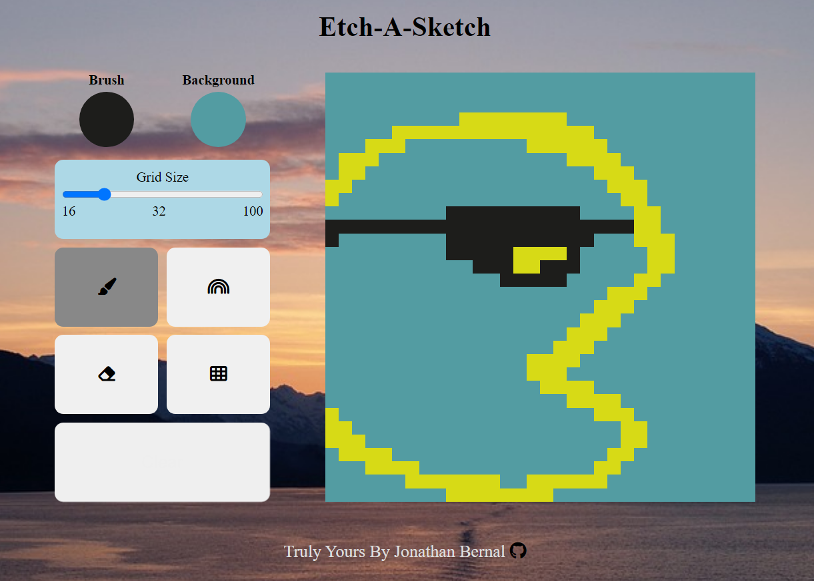

# Etch-A-Sketch

A webpage where you can draw pixel art with your mouse. You can select how big you want your grid to be among other things

## Purpose
The purpose of this project was to learn about DOM manipulation, event handlers, and CSS Flexbox and Grid applications without relying on modern libraries, like React. A canvas, a grid, an eraser, and two brushes
are provided. The second brush allows to draw with randomly generated colors.

## How to Run
1. Download the project as a Zip file and decompress it.
2. Open `index.html` on your browser, or if you are only interested in the live version, you can check it out [here](https://jonathanbernal.github.io/Etch-A-Sketch/).

Note: If time allows, this project may be further developed with more modern tools, like React. Don't worry! Updated instructions will be provided if that is ever the case.

## Thoughts and Conclusion
There were several challenges faced during this project. The most difficult one was handling the grid drawing. At the time I started this project, I was not familiar with state management. My solution to implement something similar using several variables. I also did not know about global pollution and how important it is to modularize web applications. I struggled with keeping track of which tool was currently being used. My solution involves using `AbortController` to subscribe to/unsubscribe from events. 

A better approach in which I could rewrite this project would involve React. React hooks would allow for a more granular approach to state management as well as improved modularization. It was definitely an amazing experience to understand what modern libraries/frameworks do under the hood when dealing with DOM manipulation. 

## Future Work
A future version of this project will feature React, as previously mentioned. In addition, I'd like to simply remove the grid and use the Canvas API to provide a more efficient/beautiful design. 

Finally, if at some point I have the opportunity to learn about parallel networking, I'd like to turn this app into a multiplayer one, where multiple players can participate in a drawing. Socket.io is what comes to mind when thinking about a possible solution.

Thank you for reading! 
